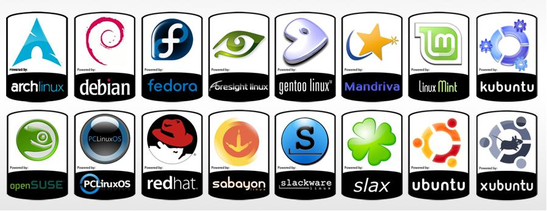

# distrolinux
## Informações sobre distros Linux
---

A tabela abaixo fornece uma visão geral das principais distribuições Linux, incluindo o tipo de empacotamento, os usos específicos recomendados e os comandos de instalação de pacotes no terminal. 

Distribuição  | Tipo de Empacotamento |       Uso Específico                              | Comandos de Instalação 
:------------:|:---------------------:|:-------------------------------------------------:|:------------------------------------------------------------------------------
Ubuntu        |DEB                    |Uso geral, desktops e servidores                   |`sudo apt install` [pacote]
Fedora        |RPM                    |Desenvolvimento, servidores, desktops              |`sudo dnf install` [pacote]
Debian        |DEB                    |Estabilidade, servidores, sistemas embarcados      |`sudo apt install` [pacote]
CentOS        |RPM                    |Servidores, estabilidade                           |`sudo yum install` [pacote]
Arch Linux    |Pacman                 |Uso avançado, rolling release                      |`sudo pacman -S` [pacote]
openSUSE      |RPM                    |Desktops, servidores                               |`sudo zypper install` [pacote]
Manjaro       |Pacman                 |Desktops, usuários intermediários                  |`sudo pacman -S` [pacote]
RHEL (Red Hat)|RPM                    |Empresarial, servidores                            |`sudo yum install` [pacote]
Slackware     |TGZ                    |Minimalismo, aprendizado                           |`sudo installpkg` [pacote.tgz], ou `slackpkg update` e `slackpkg upgrade` (*)  
Gentoo        |Portage                |Uso avançado, compilação sob demanda               |`sudo emerge` [pacote]

|**(*) No caso do Slackware são utilizados comandos dependendo da situação conforme abaixo:**

O _slackpkg_ no _Slackware_ é uma ferramenta semelhante ao _apt_ no _Debian_ e no _Ubuntu_. Ambos são gerenciadores de pacotes que facilitam a instalação, atualização e remoção de software no sistema.
O _slackpkg_ simplifica a administração de pacotes no _Slackware_, permitindo que os usuários atualizem o sistema e instalem novos pacotes de forma mais conveniente. 
Portanto, pode se considerar o _slackpkg_ como uma ferramenta análoga ao _apt_ em sistemas baseados em _Debian_. Portanto, use os comandos abaixo:

- Para atualizar e baixar pacotes: 
`slackpkg update` 
`slackpkg upgrade`

O comando _installpkg_ no _Slackware_ é usado para instalar pacotes baixados manualmente. Para usar o installpkg, é preciso fornecer o caminho completo para o arquivo do pacote que deseja instalar. Conforme comando abaixo:

- Para instalar pacotes já baixados use: 
  `sudo installpkg /caminho/para/seu_pacote.tgz`

## Na tabela abaixo consta a lista dos arquivos usados para gerenciar os repositórios em algumas distribuições populares:

Distribuição |	Arquivo de gerenciamento de repositórios                                       |
:-----------:|:--------------------------------------------------------------------------------|
Debian       |/etc/apt/sources.list                                                            |
Arch Linux	 |/etc/pacman.conf                                                                 |
Slackware	   |/etc/slackpkg/mirrors ou /etc/slackpkg/slackpkg.conf                             |
Fedora       |/etc/yum.repos.d/*.repo (os arquivos .repo dentro do diretório /etc/yum.repos.d/)|
